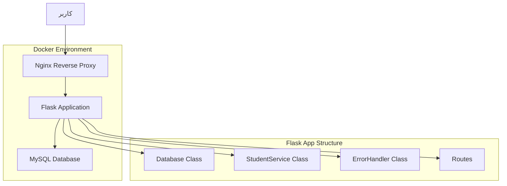

# 🎓 سیستم مدیریت دانشجویان | Student Management System

<div align="center">


[](https://github.com/tahatehran/flask_databese_manager_student/actions/workflows/docker-image.yml)
[](https://github.com/tahatehran/flask_databese_manager_student/actions/workflows/docker-build-movtigroup.yml)

**🚀 یک وب‌اپلیکیشن مدرن و کامل برای مدیریت اطلاعات دانشجویان**

[مشاهده دمو](#-نمایش-تصاویر) • [نصب سریع](#-نصب-و-راه‌اندازی) • [مستندات API](#-api-endpoints) • [مشارکت](#-مشارکت-در-پروژه)

</div>

---

## 📋 فهرست مطالب

- [🌟 ویژگی‌ها](#-ویژگیها)
- [🏗️ معماری پروژه](#️-معماری-پروژه)
- [🛠️ تکنولوژی‌های استفاده شده](#️-تکنولوژیهای-استفاده-شده)
- [⚡ نصب و راه‌اندازی](#-نصب-و-راهاندازی)
- [🐳 اجرا با Docker](#-اجرا-با-docker)
- [📡 API Endpoints](#-api-endpoints)
- [🎨 رابط کاربری](#-رابط-کاربری)
- [📁 ساختار پروژه](#-ساختار-پروژه)
- [🔧 پیکربندی](#-پیکربندی)
- [📊 نمایش تصاویر](#-نمایش-تصاویر)
- [🧪 تست](#-تست)
- [🚀 استقرار](#-استقرار)
- [🤝 مشارکت در پروژه](#-مشارکت-در-پروژه)
- [📄 مجوز](#-مجوز)
- [👨‍💻 توسعه‌دهنده](#-توسعهدهنده)

---

## 🌟 ویژگی‌ها

### 🎯 ویژگی‌های اصلی
- ✅ **مدیریت کامل دانشجویان** - افزودن، مشاهده، جستجو
- ✅ **رابط کاربری مدرن** - طراحی ریسپانسیو با انیمیشن‌های زیبا
- ✅ **پایگاه داده MySQL** - ذخیره‌سازی ایمن و قابل اعتماد
- ✅ **API RESTful** - ارتباط آسان با سایر سیستم‌ها
- ✅ **Docker Ready** - استقرار آسان در هر محیطی
- ✅ **CI/CD Pipeline** - اتوماسیون کامل توسعه و استقرار

### 🎨 ویژگی‌های طراحی
- 🌈 **طراحی مدرن** با گرادیان‌های زیبا
- 📱 **ریسپانسیو** - سازگار با تمام دستگاه‌ها
- ⚡ **انیمیشن‌های روان** - تجربه کاربری بهتر
- 🎭 **پشتیبانی از RTL** - مناسب برای زبان فارسی
- 🎪 **اشکال شناور** - پس‌زمینه انیمیشنی

### 🔒 ویژگی‌های امنیتی
- 🛡️ **اعتبارسنجی ورودی** - جلوگیری از SQL Injection
- 🔐 **مدیریت خطا** - پردازش ایمن خطاها
- 📝 **لاگ‌گیری کامل** - ردیابی تمام فعالیت‌ها

---

## 🏗️ معماری پروژه



### 🧩 اجزای سیستم

| جزء | توضیح | تکنولوژی |
|-----|-------|----------|
| **Frontend** | رابط کاربری مدرن و ریسپانسیو | HTML5, CSS3, JavaScript |
| **Backend** | سرور وب و منطق کسب‌وکار | Flask (Python) |
| **Database** | ذخیره‌سازی داده‌ها | MySQL 8.0 |
| **Web Server** | پروکسی معکوس و Load Balancer | Nginx |
| **Container** | محیط اجرای ایزوله | Docker & Docker Compose |

---

## 🛠️ تکنولوژی‌های استفاده شده

### Backend
- **Flask 2.3.3** - فریمورک وب سبک و قدرتمند
- **MySQL Connector** - اتصال به پایگاه داده
- **Gunicorn** - WSGI HTTP Server برای production

### Frontend
- **HTML5** - ساختار صفحات وب
- **CSS3** - استایل‌دهی مدرن با Grid و Flexbox
- **JavaScript ES6+** - تعامل و انیمیشن‌ها
- **Font Awesome** - آیکون‌های زیبا
- **Google Fonts (Vazirmatn)** - فونت فارسی مدرن

### DevOps & Infrastructure
- **Docker** - کانتینرسازی اپلیکیشن
- **Docker Compose** - مدیریت multi-container
- **Nginx** - وب سرور و reverse proxy
- **GitHub Actions** - CI/CD pipeline

---

## ⚡ نصب و راه‌اندازی

### 📋 پیش‌نیازها

```bash
# نصب Docker
curl -fsSL https://get.docker.com -o get-docker.sh
sh get-docker.sh

# نصب Docker Compose
sudo curl -L "https://github.com/docker/compose/releases/download/v2.20.0/docker-compose-$(uname -s)-$(uname -m)" -o /usr/local/bin/docker-compose
sudo chmod +x /usr/local/bin/docker-compose
```

### 🚀 نصب سریع

```bash
# 1. کلون کردن پروژه
git clone https://github.com/tahatehran/flask_databese_manager_student.git
cd flask_databese_manager_student

# 2. پیکربندی متغیرهای محیطی
cp docker-compose.yml.example docker-compose.yml
# ویرایش فایل docker-compose.yml و تنظیم اطلاعات دیتابیس

# 3. اجرای پروژه
docker-compose up --build -d

# 4. بررسی وضعیت
docker-compose ps
```

### 🔧 نصب دستی (بدون Docker)

```bash
# 1. کلون پروژه
git clone https://github.com/tahatehran/flask_databese_manager_student.git
cd flask_databese_manager_student

# 2. ایجاد محیط مجازی
python3 -m venv venv
source venv/bin/activate  # Linux/Mac
# یا
venv\Scripts\activate     # Windows

# 3. نصب وابستگی‌ها
pip install -r requirements.txt

# 4. تنظیم متغیرهای محیطی
export DB_HOST=localhost
export DB_USER=your_username
export DB_PASSWORD=your_password
export DB_NAME=your_database

# 5. اجرای اپلیکیشن
python app.py
```

---

## 🐳 اجرا با Docker

### 📦 Docker Compose (توصیه شده)

```yaml
# docker-compose.yml
version: '3.8'

services:
  flask_app:
    build: .
    ports:
      - "5000:5000"
    environment:
      MYSQL_HOST: mysql
      MYSQL_USER: student_user
      MYSQL_PASSWORD: secure_password
      MYSQL_DATABASE: student_db
    depends_on:
      - mysql

  mysql:
    image: mysql:8.0
    environment:
      MYSQL_ROOT_PASSWORD: root_password
      MYSQL_DATABASE: student_db
      MYSQL_USER: student_user
      MYSQL_PASSWORD: secure_password
    ports:
      - "3306:3306"
    volumes:
      - ./db_data:/docker-entrypoint-initdb.d
      - mysql_data:/var/lib/mysql

  nginx:
    build: ./nginx
    ports:
      - "80:80"
    depends_on:
      - flask_app

volumes:
  mysql_data:
```

### 🚀 دستورات مفید Docker

```bash
# اجرای کامل سیستم
docker-compose up -d

# مشاهده لاگ‌ها
docker-compose logs -f

# توقف سیستم
docker-compose down

# بازسازی تصاویر
docker-compose build --no-cache

# پاک‌سازی کامل
docker-compose down -v --rmi all
```

---

## 📡 API Endpoints

### 📊 خلاصه API

| Method | Endpoint | توضیح | پارامترها |
|--------|----------|-------|-----------|
| `GET` | `/` | صفحه اصلی | - |
| `GET` | `/students` | لیست تمام دانشجویان | - |
| `POST` | `/student` | جستجوی دانشجو | `id` |
| `POST` | `/add_student` | افزودن دانشجوی جدید | `name`, `lastname`, `age` |

### 📝 جزئیات API

#### 1️⃣ دریافت لیست دانشجویان

```http
GET /students
```

**پاسخ موفق:**
```json
[
  {
    "id": 1,
    "name": "علی",
    "lastname": "احمدی",
    "age": 20
  },
  {
    "id": 2,
    "name": "فاطمه",
    "lastname": "محمدی",
    "age": 19
  }
]
```

#### 2️⃣ جستجوی دانشجو

```http
POST /student
Content-Type: application/x-www-form-urlencoded

id=1
```

**پاسخ موفق:**
```json
{
  "id": 1,
  "name": "علی",
  "lastname": "احمدی",
  "age": 20
}
```

#### 3️⃣ افزودن دانشجوی جدید

```http
POST /add_student
Content-Type: application/x-www-form-urlencoded

name=سارا&lastname=کریمی&age=21
```

**پاسخ موفق:**
```json
{
  "id": 3,
  "name": "سارا",
  "lastname": "کریمی",
  "age": 21
}
```

### ❌ کدهای خطا

| کد | پیام | توضیح |
|----|------|-------|
| `400` | Missing required fields | فیلدهای الزامی ارسال نشده |
| `404` | Student not found | دانشجو یافت نشد |
| `500` | Database error occurred | خطای پایگاه داده |

---

## 🎨 رابط کاربری

### 🌈 ویژگی‌های طراحی

- **طراحی مدرن**: استفاده از گرادیان‌ها و سایه‌های نرم
- **انیمیشن‌های روان**: تجربه کاربری بهتر
- **ریسپانسیو**: سازگار با موبایل، تبلت و دسکتاپ
- **RTL Support**: پشتیبانی کامل از زبان فارسی
- **Dark Mode Ready**: آماده برای حالت تاریک

### 🎭 المان‌های UI

```css
/* رنگ‌های اصلی */
:root {
  --primary-color: #667eea;
  --secondary-color: #764ba2;
  --accent-color: #f093fb;
  --success-color: #48bb78;
}
```

### 📱 Breakpoints

| دستگاه | عرض | توضیح |
|---------|-----|-------|
| Mobile | < 480px | گوشی‌های کوچک |
| Mobile Large | < 768px | گوشی‌های بزرگ |
| Tablet | < 1024px | تبلت |
| Desktop | > 1024px | دسکتاپ |

---

## 📁 ساختار پروژه

```
flask_databese_manager_student/
├── 📁 .github/
│   └── 📁 workflows/          # GitHub Actions
│       ├── docker-build-movtigroup.yml
│       ├── docker-image.yml
│       └── docker-publish.yml
├── 📁 db_data/
│   └── init.sql              # اسکریپت اولیه دیتابیس
├── 📁 logs/                  # فایل‌های لاگ
│   ├── nginx_access.log
│   └── nginx_error.log
├── 📁 nginx/                 # پیکربندی Nginx
│   ├── Dockerfile
│   └── nginx.conf
├── 📁 static/                # فایل‌های استاتیک
│   └── style.css
├── 📁 templates/             # قالب‌های HTML
│   └── index.html
├── app.py                    # اپلیکیشن اصلی Flask
├── wsgi.py                   # WSGI entry point
├── requirements.txt          # وابستگی‌های Python
├── Dockerfile               # تصویر Docker
├── docker-compose.yml       # پیکربندی Docker Compose
└── README.md               # مستندات پروژه
```

### 🧩 توضیح فایل‌های مهم

| فایل | توضیح |
|------|-------|
| `app.py` | اپلیکیشن اصلی Flask شامل routes و منطق کسب‌وکار |
| `wsgi.py` | نقطه ورود برای سرورهای WSGI |
| `docker-compose.yml` | پیکربندی multi-container |
| `nginx/nginx.conf` | تنظیمات reverse proxy |
| `db_data/init.sql` | اسکریپت اولیه‌سازی دیتابیس |

---

## 🔧 پیکربندی

### 🌍 متغیرهای محیطی

```bash
# پایگاه داده
DB_HOST=mysql                 # آدرس سرور دیتابیس
DB_USER=student_user          # نام کاربری دیتابیس
DB_PASSWORD=secure_password   # رمز عبور دیتابیس
DB_NAME=student_db           # نام دیتابیس

# Flask
FLASK_ENV=production         # محیط اجرا
FLASK_DEBUG=False           # حالت دیباگ
PORT=5000                   # پورت اپلیکیشن
```

### ⚙️ تنظیمات MySQL

```sql
-- ایجاد دیتابیس
CREATE DATABASE IF NOT EXISTS student_db;
USE student_db;

-- ایجاد جدول دانشجویان
CREATE TABLE IF NOT EXISTS students (
    id INT AUTO_INCREMENT PRIMARY KEY,
    name VARCHAR(50) NOT NULL,
    lastname VARCHAR(50) NOT NULL,
    age INT NOT NULL,
    created_at TIMESTAMP DEFAULT CURRENT_TIMESTAMP,
    updated_at TIMESTAMP DEFAULT CURRENT_TIMESTAMP ON UPDATE CURRENT_TIMESTAMP
);

-- ایجاد ایندکس برای بهبود عملکرد
CREATE INDEX idx_name ON students(name);
CREATE INDEX idx_lastname ON students(lastname);
```

---

## 📊 نمایش تصاویر

### 🖥️ صفحه اصلی


### 📱 نمای موبایل


### 📊 لیست دانشجویان


---

## 🧪 تست

### 🔍 تست‌های خودکار

```bash
# اجرای تست‌ها
python -m pytest tests/

# تست با coverage
python -m pytest --cov=app tests/

# تست API endpoints
curl -X GET http://localhost:5000/students
curl -X POST http://localhost:5000/add_student \
  -d "name=تست&lastname=کاربر&age=25"
```

### 📋 چک‌لیست تست دستی

- [ ] صفحه اصلی بارگذاری می‌شود
- [ ] فرم افزودن دانشجو کار می‌کند
- [ ] جستجوی دانشجو عملکرد صحیح دارد
- [ ] لیست دانشجویان نمایش داده می‌شود
- [ ] رابط کاربری در موبایل صحیح است
- [ ] خطاها به درستی مدیریت می‌شوند

---

## 🚀 استقرار

### ☁️ استقرار در Cloud

#### Docker Hub
```bash
# ساخت و push تصویر
docker build -t yourusername/student-management .
docker push yourusername/student-management
```

#### AWS ECS
```bash
# استقرار در AWS
aws ecs create-cluster --cluster-name student-management
aws ecs create-service --cluster student-management --service-name app
```

#### DigitalOcean
```bash
# استقرار در DigitalOcean
doctl apps create --spec .do/app.yaml
```

### 🔧 تنظیمات Production

```bash
# متغیرهای محیطی production
export FLASK_ENV=production
export FLASK_DEBUG=False
export MYSQL_HOST=your-production-db-host
export MYSQL_USER=your-production-user
export MYSQL_PASSWORD=your-secure-password
```

---

## 🤝 مشارکت در پروژه

### 🎯 نحوه مشارکت

1. **Fork** کردن پروژه
2. ایجاد **branch** جدید (`git checkout -b feature/amazing-feature`)
3. **Commit** تغییرات (`git commit -m 'Add amazing feature'`)
4. **Push** به branch (`git push origin feature/amazing-feature`)
5. ایجاد **Pull Request**

### 📝 استانداردهای کد

```python
# استفاده از Black برای فرمت کد
black app.py

# بررسی کیفیت کد با flake8
flake8 app.py

# تست‌های واحد
pytest tests/
```

### 🐛 گزارش باگ

برای گزارش باگ، لطفاً [Issue جدید](https://github.com/tahatehran/flask_databese_manager_student/issues/new) ایجاد کنید و شامل:

- توضیح مشکل
- مراحل بازتولید
- محیط اجرا (OS, Python version, etc.)
- لاگ‌های مربوطه

---

## 📈 نقشه راه

### 🎯 ویژگی‌های آینده

- [ ] **احراز هویت** - سیستم لاگین و ثبت‌نام
- [ ] **مدیریت نقش‌ها** - دسترسی‌های مختلف کاربران
- [ ] **API Documentation** - Swagger/OpenAPI
- [ ] **تست‌های بیشتر** - افزایش coverage
- [ ] **کش** - Redis برای بهبود عملکرد
- [ ] **جستجوی پیشرفته** - فیلترها و مرتب‌سازی
- [ ] **گزارش‌گیری** - خروجی PDF و Excel
- [ ] **نوتیفیکیشن** - اعلان‌های real-time

### 🔄 نسخه‌های منتشر شده

| نسخه | تاریخ | تغییرات |
|------|-------|---------|
| v1.0.0 | 2024-01-15 | انتشار اولیه |
| v1.1.0 | 2024-02-01 | بهبود UI/UX |
| v1.2.0 | 2024-02-15 | افزودن Docker |

---

## 📄 مجوز

این پروژه تحت مجوز **MIT** منتشر شده است. برای جزئیات بیشتر فایل [LICENSE](LICENSE) را مطالعه کنید.

```
MIT License

Copyright (c) 2024 Taha Tehran

Permission is hereby granted, free of charge, to any person obtaining a copy
of this software and associated documentation files (the "Software"), to deal
in the Software without restriction...
```

---

## 👨‍💻 توسعه‌دهنده

<div align="center">

### 🌟 طاها تهران

[](https://github.com/tahatehran)
[](https://linkedin.com/in/tahatehran)
[](mailto:taha@example.com)

**Full-Stack Developer | Python Enthusiast | Open Source Contributor**

</div>

---

## 🙏 تشکر و قدردانی

- **Flask Team** - برای فریمورک عالی Flask
- **MySQL Team** - برای پایگاه داده قدرتمند
- **Docker Team** - برای پلتفرم کانتینرسازی
- **Font Awesome** - برای آیکون‌های زیبا
- **Google Fonts** - برای فونت Vazirmatn

---

<div align="center">

### ⭐ اگر این پروژه برایتان مفید بود، لطفاً ستاره بدهید!

**ساخته شده با ❤️ توسط [طاها تهران](https://github.com/tahatehran)**

</div>

---

## 📞 پشتیبانی

برای دریافت پشتیبانی:

- 📧 **ایمیل**: support@example.com
- 💬 **Telegram**: [@tahatehran](https://t.me/tahatehran)
- 🐛 **Issues**: [GitHub Issues](https://github.com/tahatehran/flask_databese_manager_student/issues)
- 📖 **Wiki**: [پروژه Wiki](https://github.com/tahatehran/flask_databese_manager_student/wiki)

---

<div align="center">

**🚀 آماده برای شروع؟ [نصب کنید](#-نصب-و-راهاندازی) و تجربه کنید!**

</div>